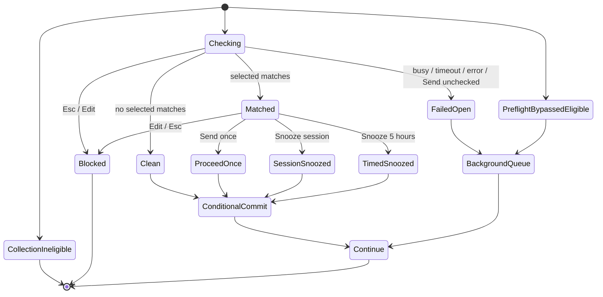
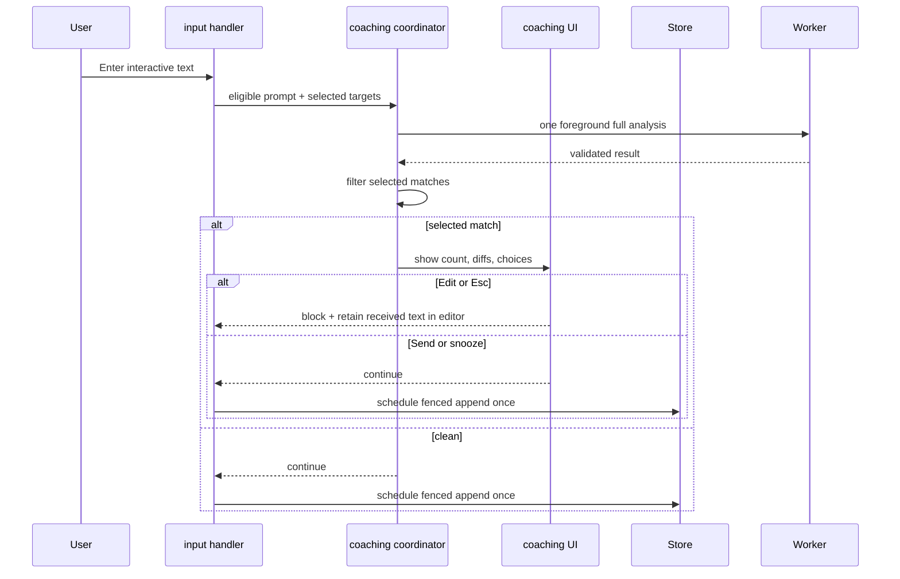
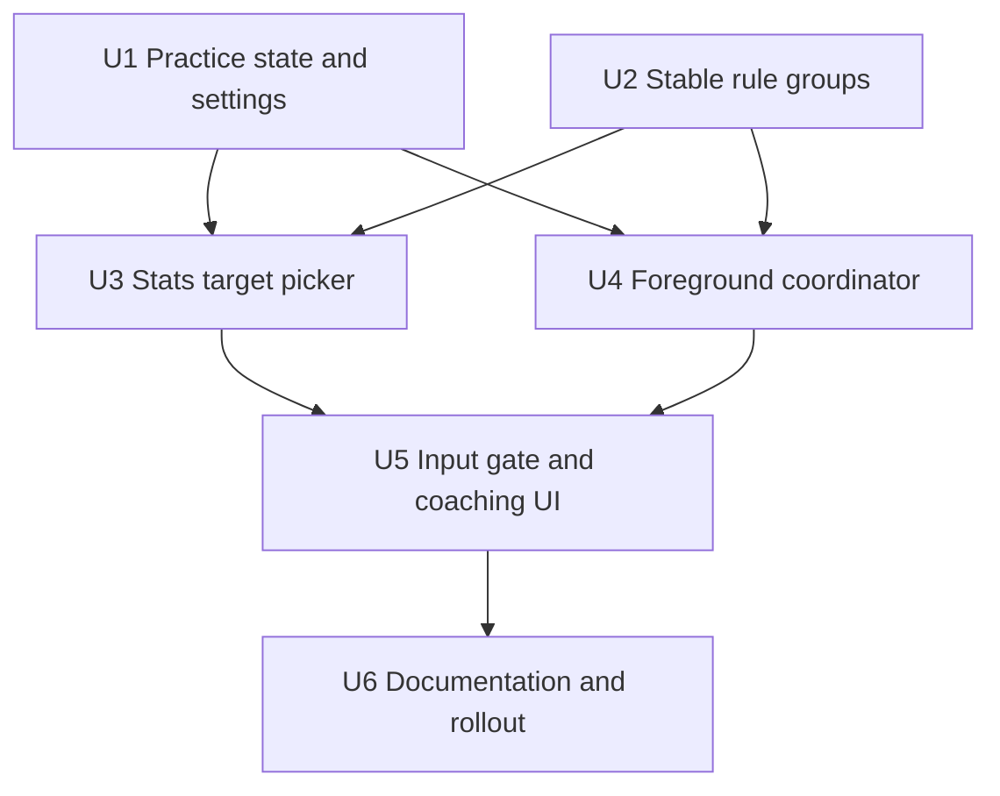
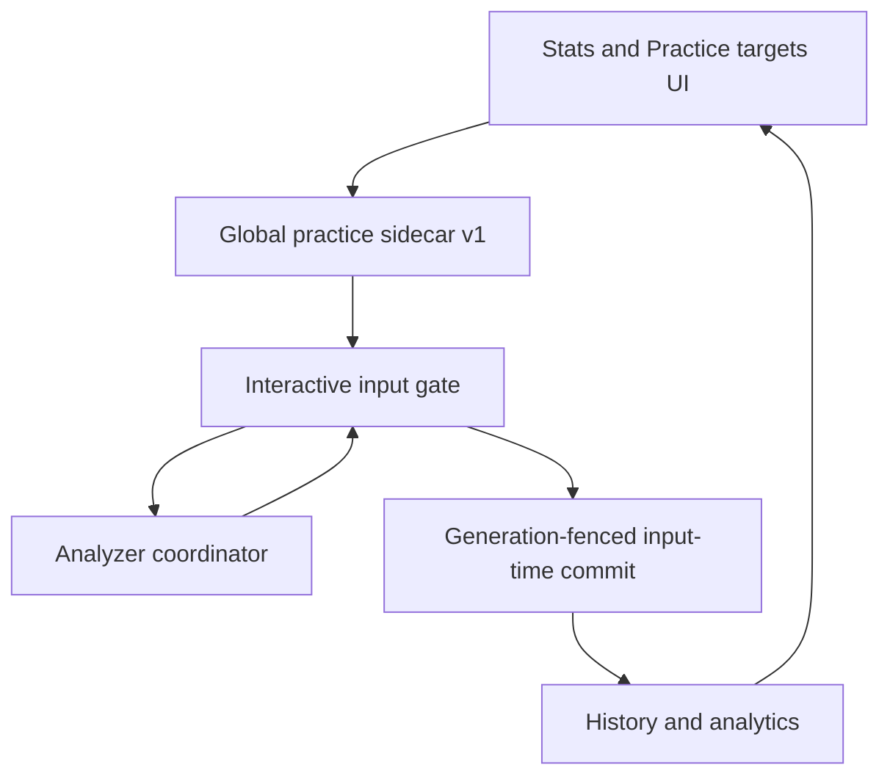

# Proactive Fluency Preflight

## Overview

Add opt-in, submit-time practice to Pi Fluency. Users choose concrete recurring rules from Stats. When an eligible interactive prompt contains a selected mistake, Pi Fluency pauses submission, shows bounded coaching, keeps the exact received draft in the editor, and lets the user edit, send once, snooze for the current session, or snooze globally for five hours.

This remains an analytical aid, not an English teacher or automatic editor. Existing background analytics continue for drafts Pi Fluency allows. Drafts blocked by Pi Fluency never enter history; as in the current extension, a later input handler may still intercept an already observed interactive draft.

| Mode | Current submission | Later submissions | Analytics |
|---|---|---|---|
| No selected rules | Sends normally | No preflight | Existing background analysis |
| Clean preflight | Sends normally | Preflight remains active | Reuse one full analysis result |
| Match + Edit / Esc | Blocked; exact received text remains in editor | Recheck changed draft | Nothing persisted for blocked attempt |
| Match + Send once | Sends once | Preflight remains active | Reuse preflight result once |
| Match + session snooze | Sends once; reuses current preflight result | Bypass for same conversation session, including reload/resume | Later bypassed prompts use background analysis |
| Match + 5-hour snooze | Sends once; reuses current preflight result | Bypass across Pi sessions until deadline | Later bypassed prompts use background analysis |
| Checking + Send unchecked | Sends immediately after bounded cancellation | Preflight remains active | Existing background analysis continues |
| Timeout, busy worker, or technical error | Sends unchecked | Preflight remains available | Existing background path may analyze later |
| Practice master switch off | Sends normally | No preflight until re-enabled | Existing background analysis continues |

---

## Problem Frame

Current Pi Fluency reports recurring mistakes after prompts have already been sent. This confirms patterns but does not create a moment for active recall before submission. Users need a selective practice mode: focus only on rules they deliberately chose, catch them at submit time, and retain an immediate escape hatch when coaching becomes disruptive.

Pi provides the required boundary. Its `input` event runs after Enter and before agent processing, can return `handled` to stop submission, and exposes text as received at Pi Fluency's position in the chained input-handler order. `ctx.ui.setEditorText()` can restore that exact received text. Pi Fluency can therefore decide and schedule analytics inside one input handler without relying on an unavailable cross-hook submission identity.

---

## Requirements Trace

- **R1. User-selected focus:** Users can select and deselect concrete recurring rules from the Stats experience, disable or resume practice as a separate mode, and clear all practice selections. Broad ERRANT categories and internal pattern keys remain hidden.
- **R2. Narrow eligibility:** Preflight runs only for idle, text-only, `source === "interactive"` submissions that pass existing collection filters and have at least one active selected rule.
- **R3. Blocking coaching:** A selected-rule match blocks submission, presents a bounded mistake count and actionable diffs/hints, and never rewrites the draft automatically.
- **R4. Explicit outcomes:** Edit and Esc leave exact text received by Pi Fluency in the editor; Send once proceeds once; session and five-hour snoozes proceed once and bypass later checks for their defined lifetime.
- **R5. Safe failure:** Before any asynchronous check, exact received text is restored into the editor. Provider, validation, UI, lock, timeout, cancellation, and shutdown failures therefore resolve without hidden loss: technical checks attempt fail-open, while inability to clear the editor returns `handled` with text still present. Foreground checking gets one attempt within six seconds plus at most 100 ms cancellation grace.
- **R6. No redundant successful analysis:** A valid full preflight result is reused for ordinary analytics rather than repeating analysis under the same configuration. If configuration changes invalidate it, one fresh background analysis under current configuration is allowed.
- **R7. Fluency-blocked history:** A draft blocked by Pi Fluency creates no observation, occurrence, word denominator, processed hash, or review item. Each successful full result for a draft Pi Fluency allows is conditionally committed at most once; eligible fail-open prompts enter the existing background path, which may exhaust retries without a record. As today, a later input extension may still intercept a draft after Pi Fluency has allowed and recorded it.
- **R8. Durable and comprehensible state:** Selected rules, practice enablement, preflight consent, and the five-hour snooze are global and durable. Conversation-session snooze follows session-file identity: it survives `/reload` and later resume of that same file, while new/forked files use their own state. Stats and direct commands expose selected/enabled/snoozed state and Resume now.
- **R9. Existing policy compatibility:** Ignore suppresses matching coaching without deleting a selection; restoring Ignore reactivates it. `/fluency clear` remains history-only and does not silently erase selected practice rules.
- **R10. Existing boundaries:** Analyzer schema v3, settings schema v3, and history schema v4 remain unchanged. Practice uses a separate strict sidecar schema. First activation requires explicit preflight consent stating that a sanitized draft may reach the configured Fluency model even when the user later chooses not to send it. Sanitization, restrictive file modes, atomic writes, interactive-only provenance, and normal review semantics remain intact.

---

## Scope Boundaries

- No live analysis while the user types. Pi has no documented editor-change event; replacing the editor component would add disproportionate coupling.
- No automatic correction, text transformation, or forced send prevention without a Send once path.
- No coaching for RPC, extension-injected input, slash commands, code-only input, image-bearing submissions, or `steer` / `followUp` input.
- No broad-category practice selection in this version; selection uses user-facing concrete recurring rules.
- No spaced-repetition curriculum, quizzes, mastery score, or self-correction analytics in this version.
- No new provider or second model. Preflight uses the configured Pi Fluency analyzer.
- No change to recurring-rule qualification, 30-day Stats calculations, accepted-rate calculations, or history retention.
- No guarantee that Pi Fluency sees the original editor bytes or the final sent text when other input-transform extensions run before or after it. Restoration is exact relative to text received by Pi Fluency. Compatible extension ordering will be documented.

### Deferred to Follow-Up Work

- Attachment-aware coaching: wait for a Pi API that can restore text and attachments together.
- Demonstrated self-correction metrics: design separately after observing whether preflight produces useful edits.
- Live editor linting: reconsider only if Pi exposes a stable draft-change hook.

---

## Context & Research

### Relevant Code and Patterns

- `extensions/pi-fluency/index.ts` owns interactive provenance, lifecycle hooks, worker creation, status publication, commands, and overlay wiring.
- `extensions/pi-fluency/collector.ts` is the canonical sanitization and eligibility boundary. Preflight must retain raw text separately because collected prose cannot reconstruct formatting or code.
- `extensions/pi-fluency/analyzer.ts` already performs one structured full-prompt analysis against bounded known patterns using analyzer schema v3.
- `extensions/pi-fluency/worker.ts` owns analyzer serialization, retry/timeout behavior, and post-settle persistence callbacks.
- `extensions/pi-fluency/analytics.ts` groups concrete rules by exact explanation and exposes only recurring groups in Stats. Current `RuleAnalytics.patternId` is a representative pattern, not a stable group identity.
- `extensions/pi-fluency/overlay.ts` provides keyboard-first modal lifecycle, bounded diff rendering, async authoritative mutations, and sanitized errors. Stats is currently scroll-only.
- `extensions/pi-fluency/store.ts` provides strict settings decoding, immutable projections, queued mutations, global locks, atomic settings replacement, and history append/clear semantics.
- `tests/extension.test.ts`, `tests/store-settings.test.ts`, `tests/worker.test.ts`, and overlay test suites show public-seam, fake-clock, deferred-promise, reopen, concurrent-store, and exact-rendering patterns.
- `docs/superpowers/specs/2026-07-19-interactive-input-provenance-design.md` remains authoritative for human-authored input boundaries.
- `docs/superpowers/specs/2026-07-30-recurring-fluency-rules-design.md` plus current `extensions/pi-fluency/analytics.ts` define recurring concrete-rule behavior; current source additionally requires accepted findings from two distinct submitted prompts.

### Institutional Learnings

No `docs/solutions/` directory exists. Existing specs and regression tests are the institutional record. Recent persistence cleanup favors strict decoders, focused pure modules, public-seam tests, and one authoritative state owner.

### External References

- Pi extension documentation: input interception, custom UI, status, session entries, and editor restoration in the [earendil-works/pi repository](https://github.com/earendil-works/pi).

Local source and installed Pi documentation provide direct patterns, so no broader external research is needed.

---

## Key Technical Decisions

| Decision | Choice | Rationale |
|---|---|---|
| Selection granularity | Concrete recurring explanation groups | Matches Stats and gives actionable practice without exposing taxonomy codes. |
| Durable target identity | Persist exact display explanation plus current member pattern keys; derive any UI key transiently | Representative pattern IDs can change, while a persisted derived ID adds no independent semantics. |
| Analyzer behavior | Run one full normal analysis with selected targets prioritized; gate only matching selected findings | Successful result can feed complete analytics, avoiding a second provider call and preserving unrelated findings. |
| Commit boundary | After Pi Fluency chooses `continue`, schedule a non-droppable conditional append from the same input handler | Pi Fluency-blocked attempts schedule nothing; generation/configuration fencing prevents late append after clear or consent/config changes without relying on cross-hook correlation. |
| Foreground concurrency | Foreground request gets priority between background items; wait only within deadline, then fail open and quarantine an unresponsive call | Prevents process-local overlap and avoids starvation behind the full background backlog. |
| Foreground deadline | Six seconds across fresh practice read, analyzer wait, and decision preparation; 100 ms maximum abort grace | Bounds interactive latency even when an analyzer ignores cancellation. User can Send unchecked or return to Edit while checking. |
| Stats interaction | `p` opens a keyboard multi-select Practice targets view from Stats; Stats marks selected rules | Avoids overloading scroll offsets as row selection while keeping configuration anchored in Stats. |
| Practice persistence | New strict `practice.json` schema v1 beside unchanged settings v3 | Avoids mixed-version writers corrupting shared settings while old Pi processes still run. Reuses private directory, atomic replacement, and global lock policy. |
| Snooze scope | Epoch-tagged custom entry in each Pi session; five-hour deadline in global practice sidecar | Session snooze survives reload/resume of that file, new/forked files have separate state, and Reset invalidates old epochs. Ephemeral sessions fall back to runtime memory. |
| Cancel behavior | Esc means Edit, never Send | Prevents accidental submission of a flagged draft. |
| Images and active-stream input | Bypass preflight | Text restoration cannot restore attachments, and blocking steering would harm agent control. |

A practice target remains selected until the user deselects it, even if it leaves the current 30-day recurring list. It remains coaching-enabled and appears under **Selected, not currently recurring**. A selected target suppressed by Ignore appears as **Selected, paused by Ignore** and does not gate until restored. `/fluency clear` preserves targets because it is explicitly a history reset; confirmed Reset practice atomically empties practice content and increments its revision, preserving only anti-ABA metadata.

The coordinator prevents overlapping analyzer calls within one Pi process. Separate Pi processes may call the configured provider concurrently; global cross-process provider serialization is intentionally out of scope.

---

## Open Questions

### Resolved During Planning

- **Does snoozing send the current draft?** Yes. Both snooze actions send the current submission once, then bypass later eligible checks.
- **What does Esc do?** It behaves as Edit: block and leave the draft in the editor.
- **Does preflight replace normal analytics?** A successful full result is scheduled once when Pi Fluency allows the draft. A failed or skipped foreground check enters the existing input-time background path.
- **How are grouped rules selected?** One Stats group persists its exact display explanation plus currently known member pattern keys; any UI key is derived transiently and internal values never render.
- **What happens after recurrence ages out?** Explicit selection remains coaching-enabled and manageable under **Selected, not currently recurring** until the user removes it.
- **What happens after Ignore or clear?** Ignore temporarily suppresses matching coaching. History clear preserves practice state; confirmed Reset practice empties user-facing practice state, advances revision, and requires fresh preflight consent before future activation.
- **How are attachments handled?** Text submissions with images bypass preflight so nothing can be lost.

### Deferred to Implementation

- Whether an expired durable snooze is removed immediately or on the next practice-sidecar mutation: either behavior is valid if the effective state and rendered status are correct.

---

## High-Level Technical Design

> *This illustrates the intended approach and is directional guidance for review, not implementation specification. The implementing agent should treat it as context, not code to reproduce.*

---

## Implementation Units

- [x] U1. **Add strict practice sidecar and lifecycle state**

**Goal:** Persist selected practice targets, master enablement, consent, and global snooze without changing the shared settings contract.

**Requirements:** R1, R8, R9, R10

**Dependencies:** None

**Files:**
- Create: `extensions/pi-fluency/practice-settings.ts`
- Modify: `extensions/pi-fluency/types.ts`
- Modify: `extensions/pi-fluency/store.ts`
- Test: `tests/practice-settings.test.ts`
- Test: `tests/store-concurrency.test.ts`

**Approach:**
- Keep settings schema v3, analyzer schema v3, and history schema v4 unchanged. Add strict `practice.json` schema v1 under the existing private global directory.
- Store separate monotonic mutation revision and Reset-only epoch, practice enabled state, explicit preflight-consent timestamp, up to 50 selected target records (exact display explanation plus deduplicated member keys), and optional finite five-hour deadline. Ephemeral sessions use runtime-only session snooze.
- Build a stable fresh policy snapshot without mutation lock: atomically read each complete file, reread both file fingerprints/revisions, and accept only when the pair is unchanged; retry optimistically within the submit deadline. Decode into one immutable snapshot and do not mutate cached store projections. Mutations still reread under the existing global lock and replace atomically so concurrent Pi processes merge authoritative state.
- Persist conversation-session snooze as a synchronous Pi custom session entry carrying Reset-only epoch plus one-way hash of originating session file. It survives reload/resume of that file; copied fork entries fail session-hash match. Reset advances epoch and invalidates old entries. Ephemeral sessions use runtime memory.
- Provide focused immutable projections/mutations for target toggles, practice on/off, both snooze scopes, Resume now, and confirmed Reset practice. Modal snooze mutations carry expected revision plus absolute operation deadline; under lock they reject stale revision or expired deadline before replacement. Newer direct Resume/Reset rereads under lock and applies to latest revision, so later user intent wins.
- Preserve `/fluency clear` as history-only. Old extension versions ignore `practice.json`, eliminating mixed-version writers.

**Execution note:** Implement strict decoder, restrictive-mode, reopen, stale-writer, and concurrent-mutation tests before wiring UI.

**Patterns to follow:**
- Exact decoding and defensive copies in `extensions/pi-fluency/store.ts`.
- Atomic settings replacement and global-lock tests in `tests/store-settings.test.ts` and `tests/store-concurrency.test.ts`.
- Session custom-entry restoration documented by Pi and represented in extension fakes.

**Test scenarios:**
- Happy path: existing settings v3 opens unchanged while missing `practice.json` yields disabled/empty practice defaults.
- Happy path: consent, master state, selected target records, and five-hour deadline survive reopen and return as independent copies.
- Happy path: two new-extension store instances toggle different targets without lost updates; an old extension process writing settings v3 cannot overwrite the sidecar; a fresh policy read observes another process's Ignore/model/practice changes without waiting for local mutation.
- Happy path: every successful sidecar mutation increments mutation revision; only Reset increments epoch; stale expected revision and expired operation deadline fail without replacement.
- Happy path: epoch- and origin-session-hash-tagged snooze survives reload/resume of the same file, copied fork entry does not apply, Reset invalidates it, unrelated target/master mutations do not invalidate it, and ephemeral sessions use runtime-only state.
- Edge case: duplicate explanations/member keys canonicalize deterministically within 50-target and field-length bounds.
- Edge case: optimistic read observes a settings replacement between sidecar reads, retries, and returns only a stable pair within deadline.
- Edge case: lock acquisition finishes after snooze operation deadline; queued mutation no-ops and cannot activate snooze later.
- Edge case: expired snooze is effectively inactive and Resume now is idempotent.
- Error path: malformed labels, arrays, timestamps, oversized collections, corrupt sidecar, and unsupported sidecar versions load safe defaults with bounded warning and never alter settings/history.
- Integration: history clear leaves practice state unchanged; Reset practice atomically writes empty user-facing state while incrementing both mutation revision and Reset-only epoch (preserving anti-ABA fencing and invalidating old session snooze entries), but does not touch history or main analytics consent.
- Privacy: sidecar and temporary replacements use mode `0600`; no raw prompt, excerpt, or correction enters practice state.

**Verification:**
- Existing settings remain byte-compatible with old extension processes.
- Practice mutations are atomic, globally serialized, deadline/revision fenced, private, and immutable at public seams.
- No history, settings, or analyzer schema changes occur.

- [x] U2. **Expose stable selectable rule groups**

**Goal:** Give Stats and coaching a stable internal representation of each user-facing recurring rule without exposing internal keys.

**Requirements:** R1, R8, R9

**Dependencies:** None

**Files:**
- Modify: `extensions/pi-fluency/analytics.ts`
- Modify: `extensions/pi-fluency/types.ts`
- Test: `tests/analytics.test.ts`

**Approach:**
- Extend recurring rule analytics with the complete current set of member pattern keys. Derive any deterministic row key from exact explanation at runtime; do not persist it.
- Keep display grouping, recurrence qualification, ordering, rates, trends, one-off aggregation, and toolbar counts unchanged.
- Add pure helpers that resolve selected targets against current patterns and Ignore policy. Gate matching may use a known member key or exact selected explanation so newly observed members of the same explanation group can match.
- Reserve selected target descriptors before filling the existing 500-known-pattern analyzer context. If selected member keys exceed remaining capacity, prioritize current patterns deterministically by target order and recency; the target explanation descriptors remain complete. The 50-target persistence bound prevents unbounded prompt growth.
- Keep pattern keys and target IDs out of rendered Stats and coaching prose.

**Execution note:** Add characterization tests for all existing recurring calculations before widening the projection.

**Patterns to follow:**
- Pure projection style in `extensions/pi-fluency/analytics.ts`.
- Distinct-prompt recurrence tests in `tests/analytics.test.ts`.

**Test scenarios:**
- Happy path: two pattern records sharing an explanation produce one selectable group with both member keys and one transient row key.
- Happy path: ordering and all numeric analytics remain byte-for-byte equivalent after metadata is added.
- Edge case: representative pattern ID changes while exact-explanation selection and transient row identity remain stable.
- Edge case: a selected target that is not currently recurring remains resolvable from durable label/member metadata and stays coaching-enabled.
- Edge case: an exact ignored pattern key or ignored category suppresses only matching coaching candidates, not accepted analytics.
- Edge case: selected member keys exceed available known-pattern slots; target descriptors remain complete and pattern inclusion is deterministic.
- Error path: terminal/control characters cannot enter target labels or rendered coaching text.

**Verification:**
- Stats still shows only recurring concrete rules in the same order and with unchanged totals.
- Selection metadata is sufficient for durable matching but never appears in user-facing output.

- [x] U3. **Add Practice targets management to Stats**

**Goal:** Let users select focus rules, inspect historical/suppressed selections, control practice mode, and resume from the Stats experience or direct commands.

**Requirements:** R1, R8, R9

**Dependencies:** U1, U2

**Files:**
- Modify: `extensions/pi-fluency/overlay.ts`
- Modify: `extensions/pi-fluency/index.ts`
- Modify: `tests/helpers/overlay-fixtures.ts`
- Test: `tests/overlay.test.ts`
- Test: `tests/overlay-rendering.test.ts`
- Test: `tests/extension.test.ts`

**Approach:**
- Add a `p` action on Stats that opens a keyboard multi-select Practice targets view rather than converting the scroll-only Stats body into a fragile wrapped-line cursor.
- Show text-backed selection markers beside recurring rules in Stats. In the picker, separate **Recurring choices**, **Selected, not currently recurring** (still coaching-enabled), and **Selected, paused by Ignore** (not currently gating).
- Before first activation, show a one-time preflight disclosure: full sanitized draft goes to the configured Fluency model before main submission and may have been analyzed even when later blocked. Persist explicit consent only after confirmation; successful first selection also enables practice, while later target toggles do not alter the master switch.
- Keyboard contract: first recurring/selected row receives initial focus; Up/Down and j/k move; Space toggles; `x` toggles practice master state; `r` resumes from session/global snooze; `c` opens confirmed Reset practice; Esc returns to Stats. Consent/Reset confirmation initially focuses Cancel; Left/Right or Tab changes focus, Enter activates, and Esc cancels. While any mutation is pending, freeze all picker actions/navigation except rendering, show `Saving…`, and accept exactly one terminal outcome.
- After a toggle removes the focused row, focus moves to the next row in reading order, then previous row, then the first available control; after Reset, focus moves to the empty-state Close/back control. Preserve focus and announce row-local error after failed mutation.
- Show effective snooze state but initiate snooze only from the coaching checkpoint. Provide Resume now here and through `/fluency practice resume`.
- Add `/fluency practice` to open the picker plus direct `on`, `off`, `resume`, and confirmed `reset` actions so sticky interception never requires navigating Stats. Extend `/fluency status` with practice enabled/selected/snoozed state without changing toolbar format.
- Rendering uses explicit labels and focus markers; no meaning depends on color or symbol alone. Preserve current Stats scrolling, view tabs, terminal-width behavior, and hidden internal identifiers.

**Patterns to follow:**
- Authoritative mutation and rerender flow used by Ignore in `extensions/pi-fluency/overlay.ts`.
- Exact visible-width and keyboard tests in `tests/overlay.test.ts` and `tests/overlay-rendering.test.ts`.

**Test scenarios:**
- Happy path: `p` from Stats opens recurring candidates; first selection requires disclosure consent; Space selects and deselects; reopen shows durable state.
- Happy path: selected marker renders next to the explanation without pattern key, target ID, or ERRANT code.
- Happy path: **Selected, not currently recurring** targets remain coaching-enabled and removable; **Selected, paused by Ignore** targets are visibly suppressed.
- Happy path: master off/on and Resume now work from picker and direct command; current state rerenders without losing selection.
- Edge case: no recurring rules and no selections render a clear empty state with no toggle action.
- Edge case: at compact widths, help labels shorten but remain textual; at very narrow widths, labels/actions stack and wrap; at short heights, body scrolls while focused row and essential footer remain discoverable.
- Error path: consent/Reset defaults safely to Cancel and Esc cancels; declined consent leaves practice disabled and target unselected; failed target/resume/master/reset persistence keeps authoritative prior state, restores prior focus, and renders a sanitized row/action error.
- Integration: opening Stats through `/fluency stats` and `/fluency practice` wires real store/session state and mutations into the picker; reload restores only conversation-session snooze for the same session file.

**Verification:**
- Users can configure practice entirely with keyboard from Stats.
- Existing Inbox, Accepted, Ignored, and Stats behaviors remain intact.

- [x] U4. **Add serialized foreground analysis and result reuse**

**Goal:** Check a draft once at submit time without racing background analysis or paying for a redundant successful call.

**Requirements:** R5, R6, R7, R10

**Dependencies:** U1, U2

**Files:**
- Create: `extensions/pi-fluency/coaching.ts`
- Modify: `extensions/pi-fluency/analyzer.ts`
- Modify: `extensions/pi-fluency/worker.ts`
- Test: `tests/coaching.test.ts`
- Test: `tests/analyzer.test.ts`
- Test: `tests/worker.test.ts`

**Approach:**
- Add a pure coaching policy module for eligibility, target matching, policy digest/revalidation, decision outcomes, and bounded result presentation.
- Extend analyzer prompt context so selected target patterns are always included within the existing known-pattern bound and are clearly prioritized. Keep one full schema-v3 result; filtering happens locally.
- Give the process one versioned analyzer coordinator shared across extension reloads through a guarded `globalThis` symbol. Coordinator owns only call serialization, active promise/controller, quarantine, and owner tokens—never store/UI/context callbacks. Each extension instance attaches a new owner token; shutdown revokes only its token and requests abort without clearing shared active state. Late results are returned only to still-current request/owner tokens. A foreground request prevents another background item from starting, waits within deadline for active work, then makes one attempt with no retry.
- At deadline or user cancellation, abort and wait at most 100 ms. If the analyzer remains unresolved, return the requested fail-open/edit outcome, quarantine process-local analysis in the reload-stable coordinator, discard any late result, and expose stable `ERR analyze`/unchecked status. Quarantine clears if the call settles; an indefinitely hung adapter remains disabled until the Pi process restarts, and later prompts fail open immediately without growing the background queue. Shutdown uses the same bounded grace.
- Successful preflight results do not enter the bounded/drop-capable worker queue. The input handler schedules one generation/configuration-fenced append after its terminal arbiter chooses `continue`. Failed/skipped checks use ordinary input-time background queue items.
- Do not cache blocked draft results in MVP. Every resubmission rechecks; this avoids raw-draft identity and stale-policy retention complexity.
- Build each foreground analyzer from the fresh main-settings snapshot rather than cached store projection. Maintain two identities: analyzer-result fingerprint (provider, model, minimum confidence, analyzer schema) and gate-policy fingerprint (targets, Ignore, practice enablement/snooze/consent, plus analyzer-result fingerprint). Background worker rebuilds when analyzer-result fingerprint changes.
- Atomically reread both practice sidecar and main settings after analysis and immediately before presenting a block, then again when the user activates send/snooze. Apply change-specific fallback: main analytics disabled/consent missing means send with no persistence; analyzer-result fingerprint change discards result and queues fresh background analysis; gate-only change removes the gate but still permits committing the valid full result under unchanged analytics configuration; Edit remains handled.

**Execution note:** Start with foreground-priority, unresponsive-abort, timeout, policy-revalidation, and one-call tests using deferred analyzers and fake timers.

**Patterns to follow:**
- Abort-aware worker lifecycle in `extensions/pi-fluency/worker.ts`.
- Canonical result validation and selected-pattern bounds in `extensions/pi-fluency/analyzer.ts`.
- Pure policy modules such as `extensions/pi-fluency/retention.ts` and `extensions/pi-fluency/analytics.ts`.

**Test scenarios:**
- Happy path: selected patterns remain in analyzer context when more than 500 known patterns exist.
- Happy path: full result contains selected and unrelated findings; only selected matches gate, while all findings remain available for normal persistence.
- Happy path: a successful foreground result is returned for one fenced append without entering the drop-capable worker queue or producing another successful result.
- Edge case: no selected-match result remains a complete ordinary analysis result.
- Edge case: sustained background backlog yields between items for foreground priority; if the current item exceeds deadline, current prompt fails open with explicit busy/unchecked state rather than starving silently.
- Edge case: another Pi process can analyze concurrently; no cross-process non-overlap guarantee is made.
- Error path: busy worker, timeout, abort-ignoring analyzer, malformed result, configuration error, and shutdown all return within deadline/grace and prevent new local overlap; indefinitely hung adapter stays quarantined across reload until settlement/process restart, old owner callbacks never fire, and new prompts fail open immediately without enqueue.
- Integration: target, Ignore, practice enablement, snooze, provider/model/minimum-confidence, or either consent change during a deferred analysis invalidates the blocking decision with its defined persistence fallback.
- Integration: background drain resumes normally after foreground success or settled failure and preserves queue bounds.
- Integration: reload during active/hung call revokes old owner, attaches new owner without replacing shared active state, ignores late old result, and preserves quarantine until settlement/process restart.

**Verification:**
- No prompt runs redundant analysis twice under the same analyzer-configuration fingerprint or persists more than one result. A failed foreground attempt—or a successful result invalidated by configuration change—may be followed by fresh background analysis under a different/current fingerprint.
- Foreground and background provider calls never overlap within one Pi process or across extension reloads in that process; indefinite quarantine requires process restart.
- Existing analyzer schema, sanitization, and background retry behavior remain intact.

- [x] U5. **Integrate submit-time gate and coaching decision UI**

**Goal:** Turn selected findings into a safe, reversible pre-send checkpoint while preserving provenance and sent-only analytics.

**Requirements:** R2, R3, R4, R5, R6, R7, R8, R9, R10

**Dependencies:** U3, U4

**Files:**
- Create: `extensions/pi-fluency/coaching-overlay.ts`
- Modify: `extensions/pi-fluency/index.ts`
- Modify: `extensions/pi-fluency/store.ts`
- Modify: `extensions/pi-fluency/status.ts`
- Modify: `tests/helpers/fakes.ts`
- Test: `tests/coaching-overlay.test.ts`
- Test: `tests/extension.test.ts`
- Test: `tests/store-generation.test.ts`
- Test: `tests/store-settings.test.ts`
- Test: `tests/status.test.ts`

**Approach:**
- Reorder idle interactive handling into an explicit state machine: source/configuration → fresh sidecar/consent/master/snooze → text-only eligibility → collection + current history-generation token → target resolution → foreground check → fresh policy revalidation → one terminal decision → conditional commit/background queue or block.
- Before starting asynchronous preflight, place the exact text received from the input event back into Pi's editor. If that initial editor write fails, do not start preflight; return `continue` because the original input event still owns submission. During a running check or matched overlay, the editor remains the authoritative recoverable copy. Use collected sanitized prose for analysis; never put received text in sidecar, history, logs, status, or conditional commits, and never restore collected prose.
- Skip preflight for images, ineligible prompts, empty target sets, disabled practice/configuration, ignored-only targets, or active snooze. Ordinary eligible bypasses use current input-time background enqueue, including `steer` and `followUp`. A globally quarantined analyzer instead sends unchecked without enqueue (preventing unbounded unusable backlog) and shows stable process-restart guidance.
- Give each attempt one compare-and-set terminal arbiter shared by analyzer completion, timeout, checking UI, matched UI, cancellation, shutdown, and error paths. Only the winner may clear or retain editor text, schedule analytics, mutate snooze, close UI, or return an input action; losers perform no side effects. During analysis, render `Checking selected fluency rules…` with `s Send unchecked` and `esc Edit`. If the checking UI itself fails, technical fail-open competes through the same arbiter.
- On matches, render at most three grouped rule sections ordered by selected-target order then source order. Show total count, `+N more` when truncated, scroll/pagination for all matches, explicit `Original:` / `Suggestion:` / `Why:` labels, and no color-only semantics.
- Matched overlay keyboard contract: Edit is initial focus; Up/Down and j/k move actions; Enter activates; `e` edits; `s` sends once; `t` snoozes conversation session; `5` snoozes five hours; PageUp/PageDown scroll details; Esc edits. While snooze persistence/policy revalidation is pending, freeze every key/action, show `Saving snooze…`, and resolve exactly once before closing or restoring focus after failure.
- Edit/Esc returns `handled` and leaves exact received text already present in the editor. Every `continue` outcome—clean, Send once, successful snooze, or technical fail-open—must first clear the editor. Return `continue` only after clearing succeeds. If clearing fails, return `handled`, keep the visible draft intact, and show `Not sent — editor could not be cleared.` This ordering prevents duplicate editor content, accidental send after Edit, and draft loss during analyzer/UI waits without introducing raw-draft persistence.
- Start five-hour snooze mutation with expected sidecar revision and absolute one-second operation deadline, while caller races confirmation against that same deadline so UI unfreezes on time. The queued mutation may still reach lock later, but must reread state and reject stale revision or expired deadline before replacement. On failure/stale/timeout, degrade to Send once, then perform a bounded stable read: report activated if authoritative state confirms it, not activated if absent, or `Sent once; snooze state unknown — use /fluency practice resume.` if state cannot be confirmed. Newer Resume/Reset rebases against latest revision. Conversation-session snooze appends its epoch-tagged session entry synchronously; ephemeral session uses runtime state. Freeze competing keys only until caller deadline/result.
- After a terminal `continue` with a successful full result, schedule one non-awaited append bound to history-generation token and analyzer-result fingerprint only—not gate-policy revision changed by snoozing. Under store lock, refresh disk state: generation change (for example `/fluency clear`) or disabled/revoked/changed analytics configuration discards stale result; configuration change may enqueue fresh background work, while disabled consent never does. This preserves current input-time analytics semantics even if a later extension handles/transforms the prompt.
- Track scheduled commit promises only for observability and bounded shutdown waiting. Generation/configuration fencing, not cancellation, guarantees an old completion cannot repopulate cleared or unauthorized history.
- Text transformed before Pi Fluency cannot be recovered as original editor bytes; text transformed after Pi Fluency can differ from analyzed prose. Document both ordering limits without claiming final-send equality.
- Restore normal progress/error status on every exit. Distinguish `Sent without practice check — analyzer busy/timed out/failed.` from `Not sent — draft remains in editor.`, `Not sent — editor could not be cleared.`, and snooze-save uncertainty; sanitize details and avoid persistent error status.

**Execution note:** Build public-seam extension tests around event return actions and history snapshots before implementing the UI.

**Patterns to follow:**
- Provenance gate and shutdown cleanup in `extensions/pi-fluency/index.ts`.
- Overlay abort/disposal and compact diff rendering in `extensions/pi-fluency/overlay.ts`.
- Stable status/error sanitization in `extensions/pi-fluency/status.ts` and `extensions/pi-fluency/sanitize.ts`.

**Test scenarios:**
- Happy path: clean idle interactive text schedules one generation/configuration-fenced append, returns continue, persists one full result, and triggers one successful provider result.
- Happy path: selected match + Edit returns handled, leaves byte-exact multiline text received by Pi Fluency in the editor, and leaves every history projection unchanged.
- Happy path: selected match + edited resubmission rechecks; a clean edit proceeds once.
- Happy path: Send once proceeds without restored duplicate editor text and persists the preflight result once.
- Happy path: conversation-session snooze sends current text, survives reload/resume of the same session file, bypasses later eligible prompts, and does not cross new/forked files.
- Happy path: five-hour snooze sends current text, bypasses other store instances until exact expiry, and Resume now re-enables checks.
- Happy path: checking overlay lets `s` send unchecked and Esc return to Edit before analysis completes.
- Edge case: several occurrences/rules render three initial groups, total and hidden count, deterministic order, scrollable remaining matches, explicit labels, and sanitized diffs without auto-editing.
- Edge case: image input, RPC/extension input, slash command, code-only text, and no selected rules never open coaching UI; eligible `steer`/`followUp` still enter existing input-time background analytics.
- Edge case: exact five-hour expiry boundary: one millisecond before bypasses, deadline and later checks. Six-second analysis deadline plus 100 ms abort grace remains bounded with an analyzer that never settles.
- Error path: analyzer timeout/error, unavailable model, busy coordinator, sidecar/settings refresh failure, overlay render failure, and shutdown attempt to send unchecked with reason; checking Esc and matched Edit never send. Every send path first clears the editor; clear failure returns handled with the draft still visible.
- Error path: initial editor preservation fails before async work, so preflight does not start and the original event continues unchanged. Later clear failure never submits or discards the editor copy.
- Error path: delayed five-hour mutation times out; bounded authoritative reread reports activated, not activated, or unknown without falsely claiming a definite state.
- Race: analyzer completion versus Send unchecked, Esc/Edit, timeout, UI failure, and shutdown resolves through one terminal arbiter; every losing branch has zero side effects.
- Race: lock-delayed snooze expires before replacement; snooze versus newer Resume/Reset in either lock order leaves the newer user intent effective; Reset advances revision without ABA.
- Race: delayed precomputed append versus clear/pause/provider change is discarded by generation/configuration fence when stale.
- Privacy: exact received text remains only in Pi's existing input event/editor during the checkpoint; it never enters sidecar, history, logs, status, or provider requests beyond existing sanitized analysis. Conditional commit holds only sanitized collected prompt, validated result, generation/configuration tokens, and bounded metadata.
- Integration: drafts blocked by Pi Fluency add no observation, word count, occurrence, processed hash, queue item, or pending card; successfully analyzed allowed attempts add at most one; exhausted failures or fenced stale commits may add zero.
- Integration: clear/pause/model change races with a delayed conditional commit cannot resurrect history or persist under stale consent/configuration.
- Integration: Ignore suppresses a selected match; restoring Ignore re-enables it without changing selection.

**Verification:**
- Every input branch ends in exactly one explicit result: `continue` after editor clear, or `handled` with text received by Pi Fluency still present in the editor. Explicit Edit/Esc never degrades into send. The plan makes no original-editor guarantee across earlier transforms.
- No prompt blocked by Pi Fluency is persisted; no allowed prompt gets redundant same-configuration analysis or more than one persisted result.
- Existing interactive-only and privacy boundaries remain true.

- [x] U6. **Document, dogfood, and release the opt-in mode**

**Goal:** Explain behavior without overpromising and verify real Pi integration before release.

**Requirements:** Documents and validates R1–R10

**Dependencies:** U5

**Files:**
- Modify: `README.md`
- Modify: `extensions/pi-fluency/setup.ts`
- Test: `tests/setup.test.ts`
- Test: `tests/manual/fake-extension.ts`

**Approach:**
- Position preflight as optional focused practice using user-selected recurring rules, not comprehensive grammar checking or teaching.
- Explain submit-time provider latency, full sanitized-prompt analysis, fail-open behavior, exact bypass options, Stats configuration, extension-order/attachment limits, editor-preservation behavior, and process-restart recovery from a hung adapter.
- Keep initial analytics consent distinct. Add concise setup copy that optional preflight requires a separate first-activation disclosure; the authoritative preflight consent lives in the Practice targets flow.
- Extend the manual harness to exercise selection, clean send, blocked edit, send once, both snoozes, resume, timeout, and narrow-terminal rendering.
- Dogfood through the locally installed checkout after automated verification. Do not modify real history directly; any reset remains confirmed `/fluency clear`.

**Execution note:** Complete automated verification before manual dogfooding; capture any real TUI regression as a focused test before fixing it.

**Patterns to follow:**
- README's current analytical-tool positioning and TUI code-block presentation.
- Consent assertions in `tests/setup.test.ts`.

**Test scenarios:**
- Happy path: setup/README accurately distinguish post-send analytics consent from separate preflight consent and state that selected interactive drafts may be checked before the main request proceeds.
- Error path: documentation states timeout/error fail-open and the user-visible bypass paths.
- Manual integration: real Pi keeps exact received text in the editor while checking, clears it before continue, retains it on Edit/clear failure, avoids duplicate send, preserves snooze boundaries, and renders responsive narrow-terminal overlays.
- Manual integration: local history changes only after a prompt proceeds, never after Edit/Esc.

**Verification:**
- README and setup copy match implemented behavior and limits.
- Full test suite, typecheck, diff check, and clean-worktree monitor pass from a fresh shell.
- Local installation loads the new flow after `/reload` without direct history edits.

**Execution evidence:**
- Installed this checkout through real Pi package discovery with `HOME` and `PI_CODING_AGENT_DIR` both isolated under a temporary root.
- Real Pi v0.82.0 loaded `pi-fluency`; `/fluency stats` rendered zeroed Stats and `/fluency practice` rendered Practice mode, selection, snooze state, empty state, and keyboard controls.
- Isolated extension storage contained only fresh zero-byte history plus generation metadata at mode `0600`; temporary root was deleted after each probe. No real history was edited or cleared.
- Full decision paths that require seeded recurring history or analyzer outcomes are covered by the real extension event harness and manual fake extension rather than production user data.

---

## System-Wide Impact

- **Interaction graph:** Stats mutates durable targets; input reads fresh effective state; process-global coordinator performs one foreground full analysis; coaching UI decides block/continue; input schedules generation/configuration-fenced commit or ordinary background work; store updates feed toolbar and Stats.
- **Error propagation:** Foreground technical failures become bounded notices/status and attempt `continue`; editor-clear failure stays `handled` with the draft visible. Explicit Edit/Esc remains the only intentional matched-flow block. Store mutation errors leave authoritative prior target/snooze state.
- **State lifecycle risks:** Stale target membership, cross-process practice state, mutation revision/deadline races, timed expiry, duplicate model calls, reload-stable quarantine, delayed conditional commits, session-key snooze restoration, editor preserve/clear ordering, and blocked-draft leakage need direct tests.
- **API surface parity:** `/fluency`, `/fluency stats`, Ctrl+Shift+L, setup, toolbar progress, and existing Inbox actions retain current behavior; `/fluency practice ...` adds direct control. No agent/RPC coaching API is added.
- **Integration coverage:** Tests must cross input terminal arbiter → conditional append/background worker → store, plus Stats picker → sidecar/session-key snooze → later input eligibility.
- **Unchanged invariants:** Only interactive human text is analyzed; slash/code filtering and secret redaction remain canonical; internal keys stay hidden; accepted rates and review decisions remain durable analytics facts for input Pi Fluency allowed; files remain mode `0600` under directory `0700`.

---

## Alternative Approaches Considered

- **Live editor wrapper:** Rejected. Pi exposes editor replacement but no stable draft-change event; wrapping the editor would create high coupling and repeated provider cost.
- **Selected-only analyzer request plus normal background analysis:** Rejected. It doubles provider calls for successful prompts and can produce inconsistent results.
- **Filter a normal full result without prioritizing targets:** Rejected. The model may omit selected rules when many known patterns compete for bounded output.
- **Persist only representative pattern ID:** Rejected. Explanation groups can contain several pattern IDs and the representative changes with retention/group membership.
- **Persist only explanation text:** Rejected. It cannot reliably prioritize known analyzer patterns and wording drift would make historical selections hard to manage.
- **Make Stats itself a wrapped-line cursor:** Rejected for first version. Wrapped lines, trend metadata, and terminal resizing make selection fragile; a dedicated picker launched from Stats is simpler and clearer.
- **Same-file settings v4 migration:** Rejected. Long-lived Pi processes running v3 can overwrite a shared v4 file after loading defaults. A separate strict practice sidecar lets old versions ignore new state safely while reusing store lock and atomic-write primitives.

---

## Risks & Dependencies

| Risk | Mitigation |
|---|---|
| Enter feels slow | One foreground attempt, six-second total deadline, no retry, visible checking overlay, immediate Send unchecked/Edit cancellation, master switch, and snoozes. |
| Prompt or attachment loss | Never handle image-bearing input; place exact received text back in Pi's editor before async work; Edit leaves it there; every send clears it first and clear failure stays handled. |
| Fluency-blocked draft enters analytics | Schedule no append/queue until terminal arbiter chooses continue; assert all history projections remain unchanged after Edit/Esc. |
| Successful prompt analyzed redundantly | Reuse valid full result; allow fresh background analysis only after configuration invalidates it; persist at most one result. |
| Foreground/background provider race | Reload-stable process coordinator, foreground priority between background items, bounded abort grace, and quarantine until late settlement/process restart. |
| Selection identity drifts | Persist exact display explanation and member keys; derive UI key transiently; retain historical selected targets for manual removal. |
| Stale policy across Pi processes | Optimistic stable pair-read of main settings + practice sidecar before analysis and before blocking/actions; concurrent mutation tests. |
| Other input extensions transform text | Define restoration/analysis relative to text received by Pi Fluency, preserve current input-time analytics semantics, and document both handler-order limitations. |
| Silent expansion of existing consent | Separate versioned preflight consent before first target activation; sidecar records acknowledgment and disclosure copy covers blocked drafts. |
| User feels trapped | Opt-in targets, Send once, two snoozes, Resume now, Esc-as-Edit, and fail-open technical paths. |
| Feature overclaims teaching value | Keep README language analytical and practice-oriented; no mastery claims. |

---

## Success Metrics

- Selected-rule prompts with a confirmed match reliably produce a reversible checkpoint.
- Technical failures add no blocked or lost submissions.
- Successfully analyzed compatible preflight causes one analyzer call and at most one history record.
- Blocked Edit/Esc attempts cause zero history changes.
- Users can select, snooze, resume, and deselect entirely by keyboard.
- Existing analytics, review, toolbar, schema-v4 history, and provenance tests remain green.

---

## Documentation / Operational Notes

- Release notes should call this opt-in preflight/practice, not real-time grammar correction.
- Mention that first practice activation requires separate consent because the configured Fluency model receives sanitized prose before submission, including drafts later blocked; main-model prompt handling is unchanged.
- Mention that image submissions and active streaming controls bypass preflight.
- Mention that earlier transforms change text Pi Fluency can restore and later transforms can change final sent text; recommend compatible extension ordering rather than claiming original-editor or final-send enforcement.
- No direct migration or edit of `~/.pi/agent/pi-fluency/history.jsonl` is permitted. `practice.json` is created/replaced only through extension-owned atomic private storage; raw drafts are not added to extension-owned persistence.

---

## Sources & References

- Related design: `docs/superpowers/specs/2026-07-19-interactive-input-provenance-design.md`
- Related design: `docs/superpowers/specs/2026-07-30-recurring-fluency-rules-design.md`
- Related implementation plan: `docs/superpowers/plans/2026-07-30-recurring-fluency-rules.md`
- Extension lifecycle: `extensions/pi-fluency/index.ts`
- Analyzer boundary: `extensions/pi-fluency/analyzer.ts`
- Worker lifecycle: `extensions/pi-fluency/worker.ts`
- Analytics projection: `extensions/pi-fluency/analytics.ts`
- Stats and review TUI: `extensions/pi-fluency/overlay.ts`
- Durable settings/history: `extensions/pi-fluency/store.ts`
- External documentation: [earendil-works/pi](https://github.com/earendil-works/pi)
